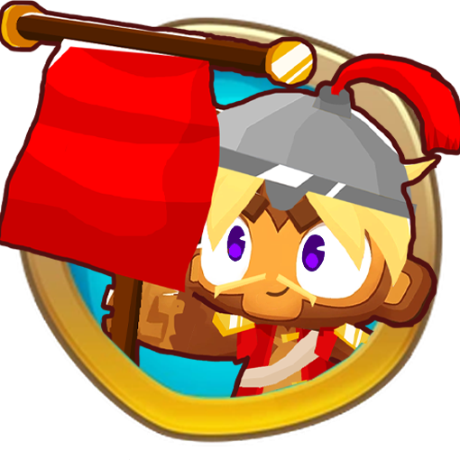

<h1 align="center">

Banner Monkey Hero Mod
</h1>

### Adds a new hero called Cyrus, Based on uniting and buffing your towers with his banners!

This tower Contains:
* 20 Complete Upgrades
* Custom Icons, Portraits and 3D Models.

## Theme of unity: This hero by design forces you to group/unite most of your towers together, by giving them various buffs and other bonuses.

